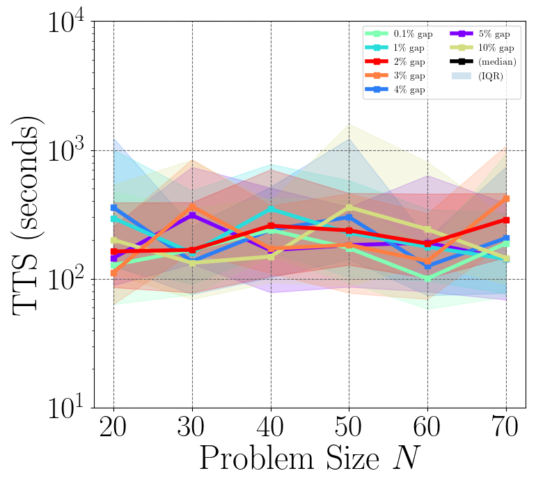

# Coherent Continous-Variable Machine

[](https://www.gnu.org/licenses/agpl-3.0)
[](http://1qbit.com/)
[](https://arxiv.org/abs/2209.04415)
[](https://github.com/1QB-Information-Technologies/ccvm)

The Coherent Continous-Variable Machine (CCVM) is a novel quantum optical network architecture built on NTT's Coherent Ising Machine (CIM). Here we demonstrate the application of CCVM on the Box-Constrained Quadratic Programming (BoxQP) problem by mapping the variables of problems into the random variables of CCVM.

## Table of Contents

1. [Quickstart](#quickstart)
2. [Usage](#usage)
3. [Docs](#docs)
4. [Contributing](#contributing)
5. [References](#references)

## Quickstart <a name="quickstart"></a>

#### Using Docker

##### Full Demo

1. Run container from anywhere

`docker run -it -v $(pwd):/workspace/examples/plots quay.io/1qbit/ccvm bash`

2. Go into `examples/` and run `ccvm-boxqp.py`

`cd examples && python ccvm-boxqp.py`

3. View generated plots from where you launched the container

<div style="display: flex;">
    <div style="flex: 1;">
        
    </div>
    <div style="flex: 1;">
        
    </div>
</div>


##### Lightweight Example


1. Run container

`docker run -it quay.io/1qbit/ccvm:slim bash`

2. Go into `examples/` and run `light-demo.py`

`cd examples && python light-demo.py`


## Usage <a name="usage"></a> (TODO)

  

#### Install dependenices

Run the following command to install dependencies:

`pip install -r requirements.txt`


#### Solve a BoxQP problem (TODO)

```
define boxqp problem

initialize solver

solve()

plot results
```


## Docs <a name="docs"></a> (TODO)

Find our [documentation here](ccvm.readthedocs.io).

Quick links:
- [BoxQP Problem Class](problem_classes/README.md)
- [ccvmplotlib](ccvmplotlib/README.md)


## Contributing <a name="contributing"></a>

We love pull requests and discussing novel ideas. Check out our [contribution guide](CONTRIBUTING.md) and feel free to improve CCVM. For major changes, please open an issue first to discuss what you would like to change.

Thanks for considering contributing to our project! We appreciate your help and support.


## References

This repo contains architectures and algorithms as discussed in the paper ["Non-convex Quadratic Programming Using Coherent Optical Networks"](https://arxiv.org/abs/2209.04415) by Farhad Khosravi, Ugur Yildiz, Artur Scherer, and Pooya Ronagh.


## License

[APGLv3](https://choosealicense.com/licenses/agpl-3.0/)