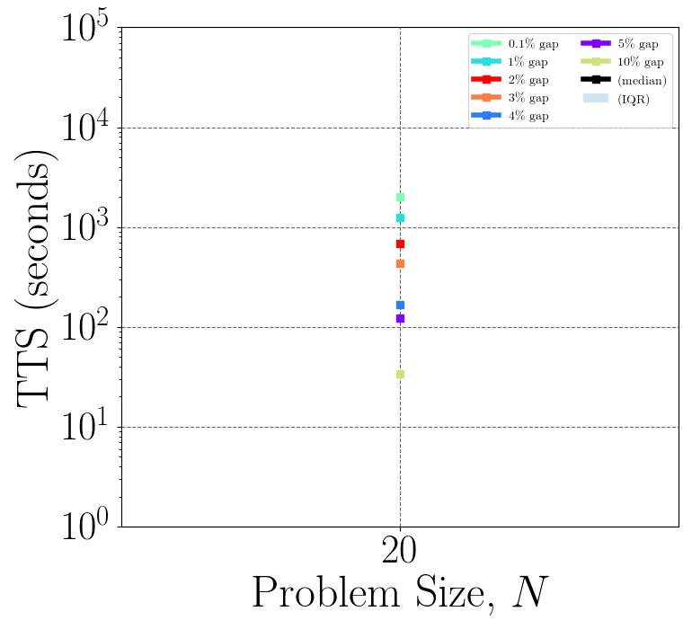

# Coherent Continous-Variable Machine

[](https://www.gnu.org/licenses/agpl-3.0)
[](http://1qbit.com/)
[](https://arxiv.org/abs/2209.04415)
[](https://urban-chainsaw-9k39nm4.pages.github.io/index.html)

The Coherent Continous-Variable Machine (CCVM) is a novel coherent quantum optical network architecture built on NTT's Coherent Ising Machine (CIM) where the physical properties of optical pulses (e.g. mean-field amplitude, phase, intensity, etc.) represent the continuous variables of a given optimization problem. Various features of the optical device and programming techniques can be used to implement the constraints imposed by these optimization problems. Here we demonstrate the application of CCVM in solving the Box-Constrained Quadratic Programming (BoxQP) problem by mapping the variables of problems into the random variables of CCVM.

## Table of Contents

0. [Requirements](#requirements)
1. [Quickstart](#quickstart)
2. [Usage](#usage)
3. [Docs](#docs)
    - [BoxQP Problem Definition](ccvm/problem_classes/README.md)
    - [ccvmplotlib](ccvm/ccvmplotlib/README.md)
4. [Contributing](#contributing)
5. [References](#references)
6. [License](#license)

### Requirements

- Python 3.10

### Supported operating systems

- MacOS (Monterey, Big Sur)
- Ubuntu (20.04)

## Quickstart


1. Once you have cloned the repo, install dependencies by navigating into the top-level directory of the repository and running

```
 pip install . --user
```

TODO: publish on pip, update above to `pip install ccvm`


2. Go into `examples/` and run demo scripts
    - `ccvm_boxqp.py`: Solve BoxQP using CCVM w/o plotting
    - `ccvm_boxqp_plot.py`: Solve BoxQP using CCVM w/ Time To Solution (TTS) plotting

3. View generated plots
    - The `ccvm_boxqp_plot.py` script solves a single problem instance, and will create an image of the resulting TTS plot in a `plots/` directory. The image, `DL-CCVM_TTS_cpu_plot.png`, will look something like this:

<p align="center">
    
</p>

## Extending the Example

4. Plotting Larger Data:
    - The script above is a toy example that only plots a single problem instance.
    - It can be extended to solve multiple problems over a range of sizes.
    - When solution metadata is saved for multiple problems, the graph becomes more informative:

<p align="center">
    
</p>


5. Other Types of Plots:
    - ccvmplotlib can also plot the Success Probability data
        - Example plot:
<p align="center">
    
</p>

## Usage

### Solve a BoxQP problem

##### 1. Add imports

```python
from ccvm.problem_classes.boxqp import ProblemInstance
from ccvm.solvers import DLSolver
```

##### 2. Define a Solver

```python
solver = DLSolver(device="cpu", batch_size=100)  # or "cuda"
solver.parameter_key = {
    20: {"pump": 2.0, "lr": 0.005, "iterations": 15000, "noise_ratio": 10},
}
```

##### 3. Load in Problem Instance

```python
boxqp_instance = ProblemInstance(
    instance_type="test",
    file_path="./examples/test_instances/test020-100-10.in",
    device=solver.device,
)
```

##### 4. Scale Coefficients
The solvers perform more reliably when the values of the coefficients are within some
range. The ideal range varies depending on the solver. For best results the problem
matrix should be passed to the solver's `get_scaling_factor()` method to determine the
best scaling value for the problem/solver combination.

```python
boxqp_instance.scale_coefs(solver.get_scaling_factor(boxqp_instance.q_matrix))
```

##### 5. Solve

```python
solution = solver.solve(
    instance=boxqp_instance,
    post_processor=None,
)

print(f"The best known solution to this problem is {solution.optimal_value}")
# The best known solution to this problem is 799.560976

print(f"The best objective value found by the solver was {solution.best_objective_value}")
# The best objective value found by the solver was 798.1630859375

print(f"The solve process took {solution.solve_time} seconds")
# The solve process took 8.949262142181396 seconds
```

## Docs

Find our [documentation here](https://urban-chainsaw-9k39nm4.pages.github.io/index.html).

* TODO: Update with public link

Some additional quick links:
- Problem Definition: [BoxQP Problem Class](ccvm/problem_classes/README.md)
- Plotting Library: [ccvmplotlib](ccvm/ccvmplotlib/README.md)


## Contributing

We love pull requests and discussing novel ideas. Check out our [contribution guide](CONTRIBUTING.md) and feel free to improve CCVM. For major changes, please open an issue first to discuss what you would like to change.

Thanks for considering contributing to our project! We appreciate your help and support.


## References

This repo contains architectures and algorithms as discussed in the paper ["Non-convex Quadratic Programming Using Coherent Optical Networks"](https://arxiv.org/abs/2209.04415) by Farhad Khosravi, Ugur Yildiz, Artur Scherer, and Pooya Ronagh.


## License

[APGLv3](https://github.com/1QB-Information-Technologies/ccvm/blob/main/LICENSE)
