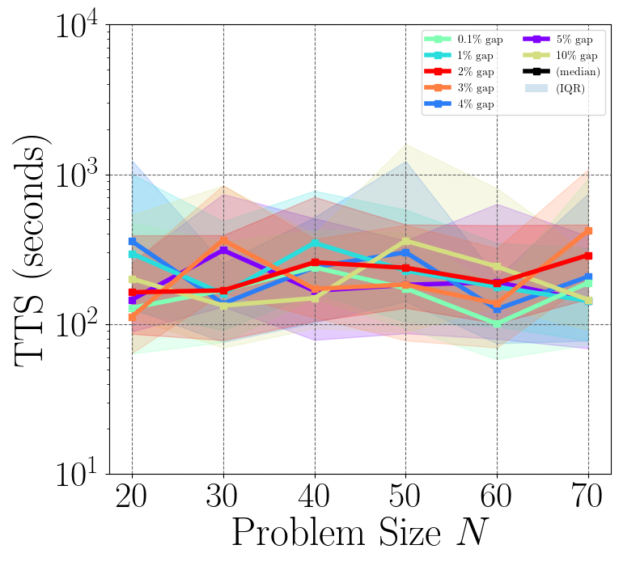
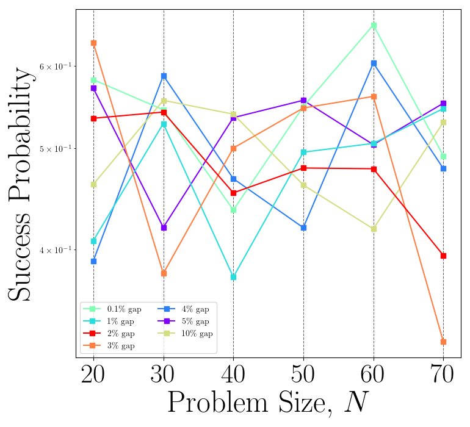

# ccvmplotlib

`ccvmplotlib` contains code for plotting results from [CCVM](https://github.com/1QB-Information-Technologies/ccvm/). It extends [Matplotlib](https://matplotlib.org/) to generate visualizations for various problem classes supported by the CCVM architecture.

### Features

- Time-To-Solve (TTS)
- Success Probability
- Time Evolution [(TODO)](https://github.com/1QB-Information-Technologies/ccvm/issues/28)
- Density Dependent TTS [(TODO)](https://github.com/1QB-Information-Technologies/ccvm/issues/29)

### Usage

```python
from ccvmplotlib import ccvmplotlib

SOLUTION_FILEPATH = "./tests/results/valid_result.json"
PLOT_OUTPUT_DEST = "./"

# Generate TTS plot
tts_plot_fig = ccvmplotlib.plot_TTS(
    solution_filepath=SOLUTION_FILEPATH,
    problem="BoxQP",
    TTS_type="wallclock",
    show_plot=True
)

# Generate success probability plot
succ_prob_plot_fig = ccvmplotlib.plot_success_prob(
    solution_filepath=SOLUTION_FILEPATH,
    problem="BoxQP",
    TTS_type="wallclock",
    show_plot=True
)

# Save plots
tts_plot_fig.savefig(PLOT_OUTPUT_DEST + "tts_plot_example.png", format="png")
succ_prob_plot_fig.savefig(PLOT_OUTPUT_DEST + "success_prob_plot_example.png", format="png")
```

#### Figures

<p align="center">
    
    
</p>