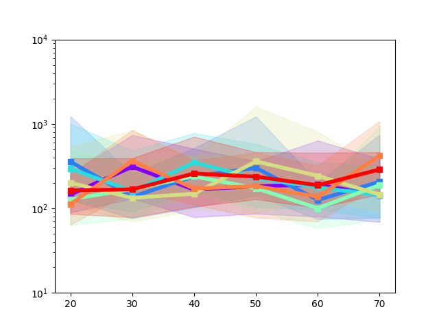
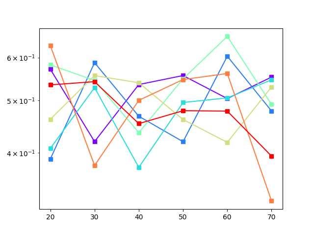

# ccvmplotlib

`ccvmplotlib` contains code for plotting results from [CCVM](https://github.com/1QB-Information-Technologies/ccvm/). It extends [Matplotlib](https://matplotlib.org/) to generate visualizations for various problem classes supported by the CCVM architecture.

### Features

- Time-To-Solve (TTS)
- Success Probability
- Time Evolution [(TODO)](https://github.com/1QB-Information-Technologies/ccvm/issues/28)
- Density Dependent TTS [(TODO)](https://github.com/1QB-Information-Technologies/ccvm/issues/29)

### Usage

```python
from ccvmplotlib import ccvmplotlib

METADATA_FILEPATH = "./tests/metadata/valid_metadata.json"
PLOT_OUTPUT_DEST = "./"

# Generate TTS plot
tts_plot_fig, tts_plot_ax = ccvmplotlib.plot_TTS(
    metadata_filepath=METADATA_FILEPATH,
    problem="BoxQP",
    TTS_type="wallclock",
)

# Generate success probability plot
succ_prob_plot_fig, succ_prob_plot_ax = ccvmplotlib.plot_success_prob(
    metadata_filepath=METADATA_FILEPATH,
    problem="BoxQP",
    TTS_type="wallclock",
)

# Apply default styling
ccvmplotlib.apply_default_tts_styling(tts_plot_fig, tts_plot_ax)
ccvmplotlib.apply_default_succ_prob_styling(succ_prob_plot_fig, succ_prob_plot_ax)

# Save plots
tts_plot_fig.savefig(PLOT_OUTPUT_DEST + "tts_plot_example.png", format="png")
succ_prob_plot_fig.savefig(PLOT_OUTPUT_DEST + "success_prob_plot_example.png", format="png")
```

### Figures

The plotting methods return a plot figure object and a plot axis object with minimal styling (e.g. plot colors, logagrithmic y-scale, etc.), and this allows users to apply their own styling before saving the figure as a file.

<p align="center">
    
    
</p>

However, a default styling method for each plot is provided and can be used as the example above.

<p align="center">
    
    
</p>
