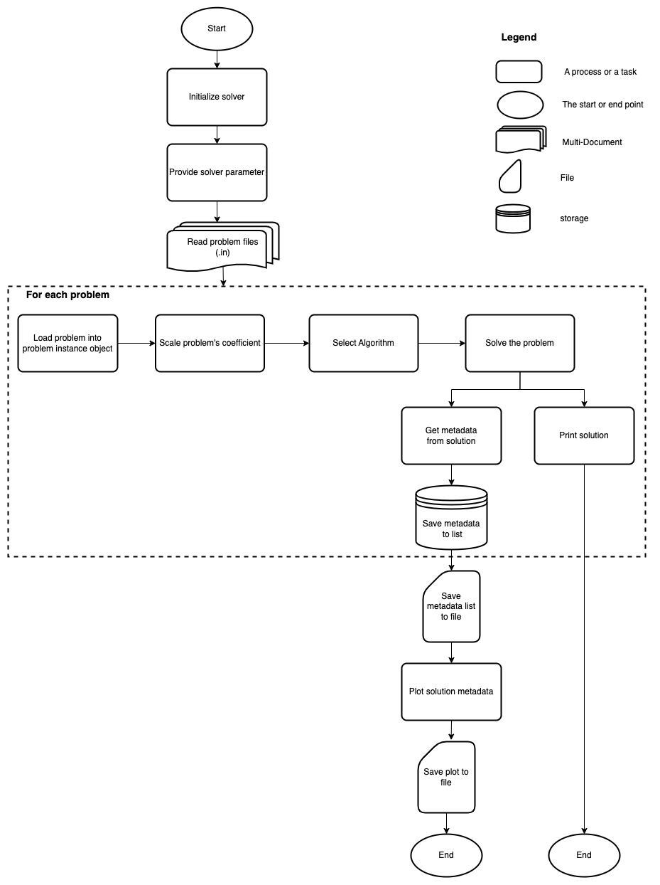
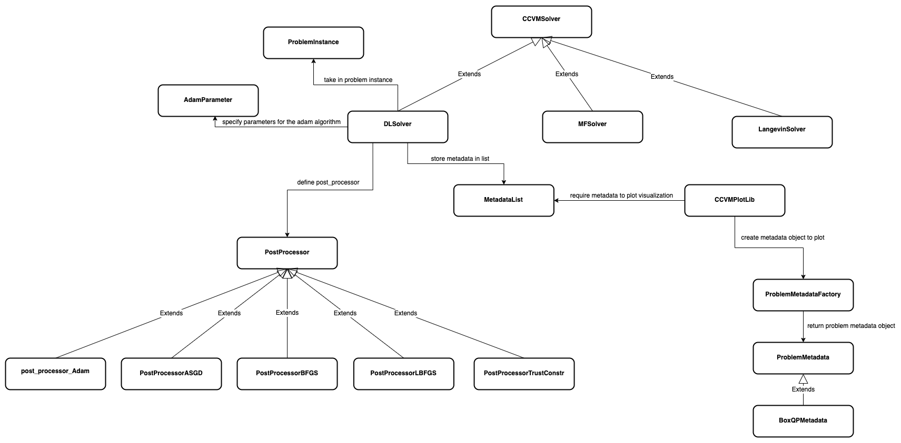

# CCVM Simulators

## Architecture and Workflow Overview

#### Example Workflow

The workflow diagram showcases, step-by-step, how the CCVM simulators can be
used to solve a problem. As users progress through the problem-solving steps,
they are presented with two distinct options to conclude their process. They can
choose to either visually plot the solution or to print the results.

    

## High-Level Class Diagram
This diagram offers a concise visualization of the main classes and their interactions within the `ccvm_simulators` package.

    

