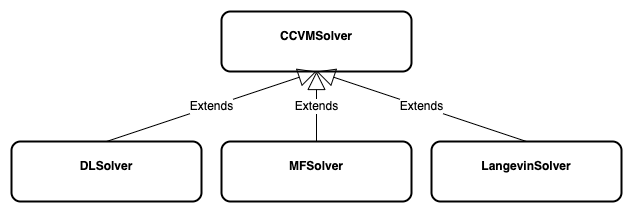

# Solvers

### Solver classes
There are currently two methods available for each solver class [DL-CCVM, MF-CCVM, Langevin] which are **original** (default) and **Adam**.

- `dl_solver.py`: models the delay-line coherent continuous-variable machine (DL-CCVM).
- `mf_solver.py`: models the measurement-feedback coherent continuous-variable machine (MF-CCVM).
- `langevin_solver.py`: models typical Langevin dynamics as a system of stochastic differential equations (SDE).

#### The solver hierarchy 
The diagram portrays the relationships among different solvers and their
association with the abstract CCVM solver class.

    

