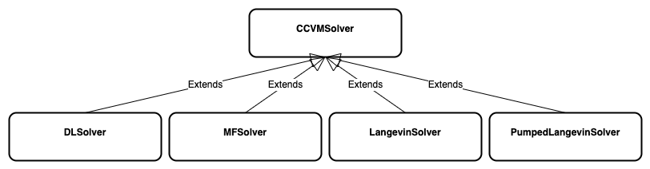

# Solvers

### Solver classes
There are currently two methods available for each solver class [DL-CCVM, MF-CCVM, Langevin, Pumped-Langevin] which are **original** (default) and **Adam**.

- `dl_solver.py`: models the delay-line coherent continuous-variable machine (DL-CCVM).
- `mf_solver.py`: models the measurement-feedback coherent continuous-variable machine (MF-CCVM).
- `langevin_solver.py`: models typical Langevin dynamics as a system of stochastic differential equations (SDE).
- `pumped_langevin_solver.py`: extends typical Langevin dynamics as a system of stochastic differential equations (SDE).
Apart from Langevin dynamics, it augments additional drift terms: 
    - a photon loss rate, `−1`
    - the strength of the external pump field, `p` and 
    - nonlinear term, `c**2_i` induced by a nonlinear crystal.

#### The solver hierarchy 
The diagram portrays the relationships among different solvers and their
association with the abstract CCVM solver class.

    

