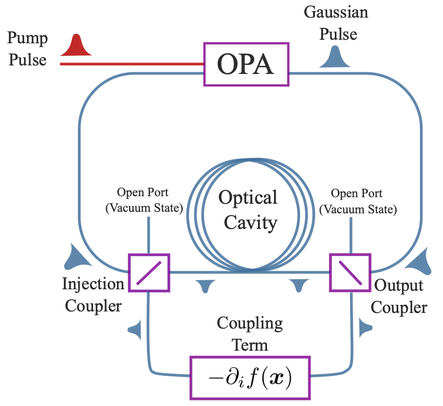

Coherent Continuous-Variable Machine Simulator - Equations of Motion
====================================

Architecture of Coherent Continuous-Variable Machines
-----------------------------------------------------------

The CCVM Simulator offers a versatile and powerful platform for exploring and solving a wide range of continuous-variable problems.
With its robust architecture and carefully selected parameters, it stands at the forefront of quantum simulation technology.

    Schematic of the CCVM architecture.

This figure shows the schematic of the architecture of a coherent continuous-variable machine (CCVM), as described in Khosravi et al. (2022).
Squeezed coherent states of light are generated and amplified using an optical parametric amplifier (OPA) that includes a nonlinear crystal pumped by a laser that, together with a ring cavity, constitutes a degenerate optical parametric oscillator (DOPO).
Information is encoded in the amplitudes of the time-multiplexed optical pulses that propagate within the resonator, which are coherently amplified each time they pass through the OPA element.
Coupling between each pair of optical pulses is implemented by taking a portion of each pulse using an output coupler, calculating the gradient of the objective function using either a delay-line network or a measurement-feedback scheme, and feeding the result into each optical pulse using an injection coupler.
These couplers, in general, are variable beamsplitters.
Using this scheme, and repeating this process an arbitrary number of times, the system is driven towards the minimum of the objective function, whose gradient is implemented using the coupling mechanism.
The solution of the optimization problem is represented by the final values of the amplitudes of the optical pulses in the cavity.

Parameter values
----------------

These parameters, chosen for the three types of solvers implemented within the simulator, are presented in the following table:

.. math::

   \begin{array}{|c||c|c|c|}\hline
        \text{ Parameter } & \text{ Langevin } & \text{DL-CCVM} & \text{MF-CCVM} \\\hline
   n_\text{iter} & 500-1500 & 1000-10000 & 300-4000\\\hline
   p_0 & -  & 8.0& 0.0 \\\hline
   dt & 0.002 & 0.001 & 0.0025 \\\hline
   \sigma  & 0.5 & - & - \\\hline
   (r_0,\beta) & - & (10,3) & - \\\hline
   A_s & - & 10 & -\\\hline
   s & - & 1.2\sqrt{p_0-1} & 20.0 \\\hline
   (j_0, \alpha) & - & - & (5,3)\\\hline
   \lambda & 1.0 & - & 2500 \\\hline
   g & - & - & 0.001\\\hline
   \end{array}

Specific equations and their respective parameters are discussed in the solver-specific pages:

.. toctree::
   :maxdepth: 3
   :caption: Contents:

   langevin_sde
   dl_ccvm_sde
   mf_ccvm_sde
